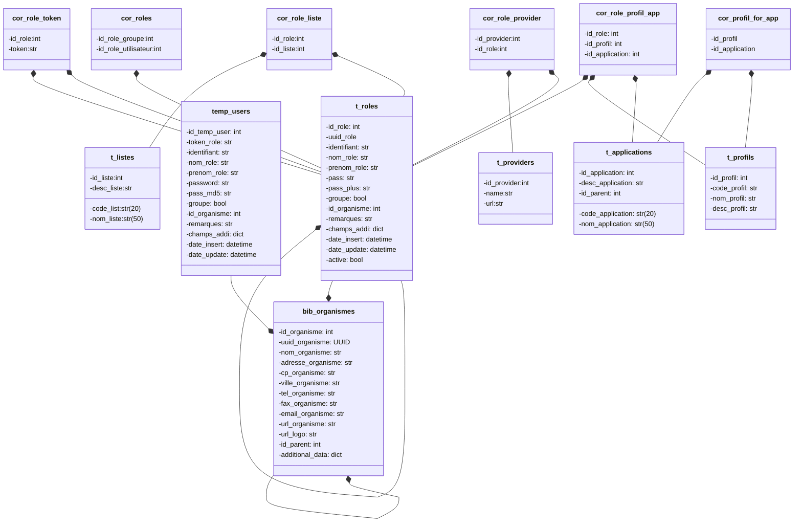

# UsersHub-authentification-module [](https://github.com/PnX-SI/UsersHub-authentification-module/actions/workflows/pytest.yml)[](https://codecov.io/gh/PnX-SI/UsersHub-authentification-module)

UsersHub-authentification-module est une extension [Flask](https://flask.palletsprojects.com/) permettant d'intégrer un système d'authentification et de gestion de sessions utilisateurs à son application. L'extension fournit un mécanisme d'authentification basé sur une base de données locale et permet également de se connecter via des mécanismes d'authentification externe standard (OAuth, OIDC).
La gestion des session est gérée par l'extension [Flask-Login](https://flask-login.readthedocs.io/en/latest/).

## Get Started

### Installation

```sh
pip install pypnusershub
```

### Application Flask minimale

Pour disposer des routes de connexion/déconnexion avec le protocole de connexion par défaut, le code minimal d'une application Flask est le suivant:

```python
from flask import Flask
from pypnusershub.auth import auth_manager

app = Flask(__name__) # Instantiate a Flask application
app.config["URL_APPLICATION"] = "/" # Home page of your application
providers_config = # Declare identity providers used to log into your app
    [
      # Default identity provider (comes with UH-AM)
      {
        "module" : "pypnusershub.auth.providers.default.LocalProvider",
        "id_provider":"local_provider"
      },
      # you can add other identity providers that works with OpenID protocol (and many others !)
    ]
auth_manager.init_app(app,providers_declaration=providers_config)

if __name__ == "__main__":
  app.run(host="0.0.0.0",port=5000)
```

### Protèger une route

Pour protéger une route en utilisant les profils de permissions, utilisez le décorateur `check_auth(niveau_profil)`:

```python
from pypnusershub.decorators import check_auth

@adresses.route('/', methods=['POST', 'PUT'])
@check_auth(4) # Decorate the Flask route
def insertUpdate_bibtaxons(id_taxon=None):
  pass
```

Si vous voulez limitez l'accès à une route uniquement aux utilisateurs connectés (qu'importe leur profils), utilisez le décorateur `login_required` de Flask-login

```python
from flask_login import login_required

@adresses.route('/', methods=['POST', 'PUT'])
@login_required
def insertUpdate_bibtaxons(id_taxon=None):
  pass
```

## Installation

### Pré-requis

- Python 3.9 ou (ou version supérieure)
- PostgreSQL 11.x (ou version supérieure)
- Paquets systèmes suivants: `python3-dev`,`build-essential`, `postgresql-server-dev`

### Installer `UsersHub-authentification-module`

Cloner le dépôt (ou télécharger une archive), dirigez vous dans le dossier et lancez la commande :

```
pip install .
```

### Configuration de l'extension

#### Configuration Flask

Indiquer la route de la _homepage_ de votre application dans la variable `URL_APPLICATION`

Pour manipuler la base de données, nous utilisons l'extension `flask-sqlalchemy`. Si votre application déclare déjà un objet `flask_sqlalchemy.SQLAlchemy`, déclarer le chemin python vers celui-ci dans la variable de configuration `FLASK_SQLALCHEMY_DB`.

```python
os.environ["FLASK_SQLALCHEMY_DB"] = "unmodule.unsousmodule.nomvariable"
```

#### Configuration de Flask-login

Paramètres à rajouter dans la configuration ( attribut `config` de l'objet `Flask`) de votre application.

Les paramètre concernant la gestion du cookie sont gérés par flask-admin : https://flask-login.readthedocs.io/en/latest/#cookie-settings

`REDIRECT_ON_FORBIDDEN` : paramètre de redirection utilisé par le décorateur `check_auth` lorsque les droits d'accès à une ressource/page sont insuffisants (par défaut lève une erreur 403)

#### Lien avec UsersHub

Pour utiliser les routes de UsersHub, ajouter les paramètres suivants dans la configuration de l'application :

- `URL_USERSHUB` : Url de votre UsersHub
- `ADMIN_APPLICATION_LOGIN` , `ADMIN_APPLICATION_PASSWORD`, `ADMIN_APPLICATION_MAIL` : identifiant de l'administrateur de votre UsersHub

```python
app.config["URL_USERSHUB"]="http://usershub-url.ext"

# Administrateur de mon application
app.config["ADMIN_APPLICATION_LOGIN"]="admin-monapplication"
app.config["ADMIN_APPLICATION_PASSWORD"]="monpassword"
app.config["ADMIN_APPLICATION_MAIL"]="admin-monapplication@mail.ext"
````

> [!TIP]
> Si vous souhaitez une interface permettant de modifier les données utilisateurs décritent dans `UsersHub-authentification-module`, il est conseillé d'utiliser [UsersHub](https://github.com/PnX-SI/UsersHub).

#### Configuration de la base de données

**Création des tables et schémas nécessaires**

`UsersHub-authentification-module` s'appuit sur un schéma PostgreSQL nommé `utilisateurs`. Pour créer ce dernier et l'ensemble des tables nécessaires, on utilise `alembic`. Alembic est une librairie Python de versionnage de base de données. Chaque modification sur la base de données est décrite par une révision (e.g. `/src/pypnusershub/migrations/versions/fa35dfe5ff27_create_utilisateurs_schema.py`). Cette dernière indique quelles sont les actions sur la base de données à effectuer pour:

- passer à la révision suivante -> méthode `upgrade()`
- mais aussi pour revenir à la précédente -> méthode `downgrade()`.

Avant de lancer la création du schéma, indiquer la nouvelle url de connexion à votre BDD dans la variable `sqlalchemy.url` dans le fichier `alembic.ini`.

```ini
sqlalchemy.url = postgresql://parcnational:<mot_de_passe>@localhost:5432/db_name
```

Une fois modifié, lancer la commande suivante pour remplir la base de données:

```sh
alembic upgrade utilisateurs@head
```

**N.B.** Si vous utilisez `alembic` dans votre projet, il est possible d'accéder aux révisions de `UsersHub-authenfication-module` à l'aide de la variable [`alembic.script_location`](https://alembic.sqlalchemy.org/en/latest/tutorial.html#editing-the-ini-file).

**Remplissage des tables pour son application**

Pour utiliser votre application avec les `UsersHub-authentification-module`, il est nécessaire :

- D'avoir (au moins) un utilisateur dans la table `t_roles`
- Enregister votre application dans `t_applications`
- Avoir au moins un profil de permissions dans `t_profils`
- Associer les profils crées à votre application dans `cor_profil_for_app`
- Enfin, pour associer votre utilisateur au couple --profil, app--, remplisser la table `cor_role_app_profil` (Nécessaire pour utiliser le décorateur `pypnusershub.decorators.check_auth`)

Ci-dessous, un exemple minimal d'une migration _alembic_ pour utiliser `UsersHub-authentification-module` pour votre application

```python
from alembic import op
import sqlalchemy as sa

# revision identifiers, used by Alembic.
revision = "id_revision"
down_revision = "id_revision_precedente"
branch_labels = "branch_votre_application"
depends_on = None


def upgrade():
    op.execute(
        """
    INSERT INTO utilisateurs.t_roles (id_role, nom_role, desc_role)
    VALUES (1, 'Grp_admin', 'Role qui fait des trucs');


    INSERT INTO utilisateurs.t_applications (id_application,code_application, nom_application,desc_application, id_parent)
    VALUES (250,'APP','votre_application','Application qui fait des trucs', NULL);

    INSERT INTO utilisateurs.t_profils (id_profil, code_profil, nom_profil, desc_profil)
    VALUES (15, 15, 'votre_profil', 'Profil qui fait des trucs');

    INSERT INTO utilisateurs.cor_profil_for_app (id_profil, id_application)
    VALUES (1, 250);

    INSERT INTO utilisateurs.cor_role_app_profil (id_role, id_application, id_profil,is_default_group_for_app)
    VALUES (1, 250, 15, true);

    """
    )


def downgrade():
    op.execute(
        """
    DELETE FROM utilisateurs.cor_role_app_profil cor
    USING
        utilisateurs.t_roles r,
        utilisateurs.t_applications a,
        utilisateurs.t_profils p
    WHERE
            cor.id_role = r.id_role
        AND cor.id_application = a.id_application
        AND cor.id_profil = p.id_profil
        AND r.nom_role = 'Grp_admin'
        AND a.code_application = 'APP'
        AND p.code_profil = 15
    """
    )

    op.execute(
        """
    DELETE FROM utilisateurs.cor_profil_app
    WHERE id_profil = 15
        AND id_application = 250;
    """
    )

    op.execute(
        """
    DELETE FROM utilisateurs.t_profils
    WHERE code_profil = 15;
    """
    )

    op.execute(
        """
    DELETE FROM utilisateurs.t_applications
    WHERE code_application = 'APP';
    """
    )

```

## Utilisation de l'API

### Ajout des routes

Les routes déclarées par le _blueprint_ de `UsersHub-authentification-module` sont automatiquement ajoutés dans le blueprint de votre application lors de l'appel de la méthode `init_app()` de l'object `AuthManager`.

### Routes définies par UsersHub-authentification module

Les routes suivantes sont implémentés dans `UsersHub-authentification-module`:

| Route URI           | Action                                                                                                                                         | Paramètres                 | Retourne                         |
| ------------------- | ---------------------------------------------------------------------------------------------------------------------------------------------- | -------------------------- | -------------------------------- |
| `/providers`        | Retourne l'ensemble des fournisseurs d'identités activés                                                                                       | NA                         |                                  |
| `/get_current_user` | Retourne les informations de l'utilisateur connecté                                                                                            | NA                         | {user,expires,token}             |
| `/login/<provider>` | Connecte un utilisateur avec le provider <provider>                                                                                            | Optionnel({user,password}) | {user,expires,token} ou redirect |
| `/public_login`     | Connecte l'utilisateur permettant l'accès public à votre application                                                                           | NA                         | {user,expires,token}             |
| `/logout`           | Déconnecte l'utilisateur courant                                                                                                               | NA                         | redirect                         |
| `/authorize`        | Connecte un utilisateur à l'aide des infos retournées par le fournisseurs d'identités (Si redirection vers un portail de connexion par /login) | {data}                     | redirect                         |

> [!TIP]
> Certaines routes utilisées accessibles depuis `UsersHub-authentification-module` proviennent du module `UsersHub`. Les routes sont les suivantes :
>
> | Route URI                   | Action                                                                                                           | Paramètres                               | Retourne                                   |
> | --------------------------- | ---------------------------------------------------------------------------------------------------------------- | ---------------------------------------- | ------------------------------------------ |
> | `/create_tmp_user`          | Création d'un utilisateur temporaire en base                                                                     | {données sur l'utilisateur}              | {token}                                    |
> | `/valid_temp_user`          | Création utilisateur en base dans la table t_role et ajout d'un profil avec code 1 pour une l’application donnée | {token, application_id}                  | {role}                                     |
> | `/create_cor_role_token`    | Génère un token pour utilisateur ayant l’email indiqué et stoque le token dans cor_role_token                    | {email}                                  | {role}                                     |
> | `/change_password`          | Mise à jour du mot de passe de l’utilisateur et suppression du token en base                                     | {token, password, password_confirmation} | {role}                                     |
> | `/change_application_right` | Modifie le profil de l’utilisateur pour l’application                                                            | {id_application, id_profil, id_role}     | {id_role, id_profil, id_application, role} |
> | `/update_user`              | Mise à jour d'un rôle                                                                                            | {id_role, données utilisateur}           | {role}                                     |

### Méthodes définies dans le module

- `connect_admin()` : décorateur pour la connexion d’un utilisateur type admin a une appli ici usershub. Paramètres à renseigner dans la configuration.
- `post_usershub()` : route générique pour appeler les route usershub en tant qu'administrateur de l'appli en cours.
- `insert_or_update_role` : méthode pour insérer ou mettre à jour un utilisateur.

### Changement du prefix d'accès aux routes de UsersHub-authentification-module

Par défaut, les routes sont accessibles depuis le préfixe `/auth/`. Si vous voulez changer cela, il suffit de modifier le paramètre `prefix` de l'appel de la méthode `AuthManager.init_app()` :

```python
auth_manager.init_app(app, prefix="/authentification", providers_declaration=providers_config)
```

## Connexion à l'aide de fournisseurs d'identités extérieurs

Depuis la version 3.0, il est possible d'ajouter la possibilité de se connecter à des fournisseurs d'identités externes utilisant d'autres protocoles de connexion : OpenID, OpenID Connect, CAS (INPN), etc. ...

### Utiliser les protocoles de connexions existant

Lors de l'appel de `AuthManager.init_app`, il faut indiquer les configurations des différents fournisseurs d'identités sur lesquels on souhaite se connecter dans le paramètre `providers_declaration`.

Pour chaque configuration, on doit déclarer :

- le chemin vers la classe Python `module` déclarant le protocole de connexion
- son identifiant unique `id_provider`
- et les variables de configurations propre au protocole de connexion

```python
from flask import Flask
from pypnusershub.auth import auth_manager

app = Flask(__name__) # Instantiate a Flask application
app.config["URL_APPLICATION"] = "/" # Home page of your application
providers_config = # Declare identity providers used to log into your app
    [
      # Default identity provider (comes with UH-AM)
      {
        "module" : "pypnusershub.auth.providers.default.LocalProvider",
        "id_provider":"local_provider"
      },
      # Other identity provider
      {
        "module": "pypnusershub.auth.providers.openid_provider.OpenIDProvider",
        "id_provider":"open_id_1",
        "ISSUER":"http://<realmKeycloak>",
        "CLIENT_ID":"secret",
        "CLIENT_SECRET":"secret"
      }

      # you can add other identity providers that works with OpenID protocol (and many others !)
    ]
auth_manager.init_app(app,providers_declaration=providers_config)

if __name__ == "__main__":
  app.run(host="0.0.0.0",port=5200)
```

Pour lancer la connexion sur un provider en particulier, il suffit d'appeler la route `/login/<id_provider>`.

### Paramètres de configurations des protocoles de connexions inclus

**OpenID et OpenIDConnect**.

- `group_claim_name` (string) : nom du champs retournée par le fournisseur d'identités dans lequel se trouve la liste de groupes auquel l'utilisateur appartient (par défaut : "groups").
- `ISSUER` (string) : URL du fournisseur d'identités
- `CLIENT_ID` (string) : Identifiant publique de l'application auprès du fournisseur d'identités.
- `CLIENT_SECRET` (string) : Clé secrete connue uniquement par l'application et le fournisseur d'identités.

**UsersHub-authentification-module**

- `login_url` : URL absolue vers la route `/auth/login` de l'application Flask.
- `logout_url` : URL absolue vers la route `/auth/login` de l'application Flask.

**CAS INPN**

- `URL_LOGIN` et `URL_LOGOUT` (string) : route de déconnexion de l'API de l'INPN (par défaut https://inpn.mnhn.fr/auth/login et https://inpn.mnhn.fr/auth/logout)
- `URL_VALIDATION` (string) : URL qui permet de valider le token renvoyer après l'authentification de l'utilisateur sur le portail de l'INPN (par défaut: https://inpn.mnhn.fr/auth/serviceValidate").
- `URL_INFO` (string) : A l'aide des infos retournées par `URL_VALIDATION`, permet de récupérer les informations d'un utilisateurs (par défaut: https://inpn.mnhn.fr/authentication/information).
- `WS_ID` et `WS_PASSWORD` (string): identifiant et mot de passe permettant d'accéder au service accessible sur `URL_INFO`.
- `USERS_CAN_SEE_ORGANISM_DATA` (boolean): indique si l'utilisateur connecté peut voir les données de son organisme (par défaut: false).
- `ID_USER_SOCLE_1` et `ID_USER_SOCLE_2` : `ID_USER_SOCLE_1` indique le groupe dans l'instance GeoNature qui permet à l'utilisateur de voir les données de son organisme. Dans le cas contraire, il est associé au groupe indiqué dans `ID_USER_SOCLE_2`.

### Ajouter son propre protocole de connexion

L'ensemble des protocoles de connexion dans `UsersHub-authentification-module` n'est pas exhaustif et peut dans certains cas ne pas convenir à votre contexte. Pas de panique ! Il est possible de déclarer son propre protocole à l'aide de la classe `Authentication` comme dans l'exemple ci-dessous :

```python
from marshmallow import Schema, fields
from typing import Any, Optional, Tuple, Union

from pypnusershub.auth import Authentication, ProviderConfigurationSchema
from pypnusershub.db import models, db
from flask import Response


class NEW_PROVIDER(Authentication):
    is_external = True # go through an external connection portal

    def authenticate(self, *args, **kwargs) -> Union[Response, models.User]:
        pass # return a User or a Flask redirection to the login portal of the provider

    def authorize(self):
        pass # must return a User

    def revoke(self):
        pass # if specific action have to be made when logout

    def configure(self, configuration: Union[dict, Any]):
        pass # Indique la configuration d'un fournisseur d'identités
```

Un **protocole de connexion** est défini par 5 méthodes et plusieurs attributs.

Les attributs sont les suivants

- L'attribut `id_provider` indique l'identifiant de l'instance du provider.
- Les attributs `logo` et `label` sont destinés à l'interface utilisateur.
- L'attribut `is_external` spécifie si le provider permet de se connecter à une autre application Flask utilisant `UsersHub-authentification-module` ou à un fournisseur d'identité qui requiert une redirection vers une page de login.
- L'attribut `login_url` et `logout_url`, si le protocole de connexion nécessite une redirection
- L'attribut `group_mapping` contient le mapping entre les groupes du fournisseurs d'identités et celui de votre instance de GeoNature.

Les méthodes sont les suivantes :

- `authenticate`: Lancée sur la route `/auth/login`, elle récupère les informations du formulaire de login et retourne un objet `User`. Si le protocole de connexion doit rediriger l'utilisateur vers un portail, alors authenticate retourne une `flask.Response` qui redirige vers ce dernier.
- `authorize`: Cette méthode est lancée par la route `/auth/authorize` qui récupère les informations renvoyés par le fournisseur d'identités après la connexions sur le portail.
- `configure(self, configuration: Union[dict, Any])`: Permet de récupérer et d'utiliser les variables présentes dans le fichier de configuration. Il est possible aussi de valider les résultats à l'aide d'un schéma `marshmallow`
- `revoke()`: Permet de spécifier un fonctionnement spécifique lors de la déconnexion d'un utilisateur.

## Schéma de la base de données

> [!IMPORTANT]
>
> #### Concepts essentiels
>
> **Profil**: Concept associé à un nom et à un niveau de permission.
> **Provider**: Concept associé à celui de fournisseurs d'identités. Service (Google, INPN, ORCID,...) qui permet de s’identifier et qui utilise un protocole de connexion (e.g. _OAuth_)
> **Listes**: Groupe d'utilisateurs

### Structure de la base

Le diagramme ci-dessous décrit les différentes tables du schéma `utilisateurs`, leurs attributs et leur relations.



**Fonctions des tables**

| Nom table           | Description                                                                                  |
| ------------------- | -------------------------------------------------------------------------------------------- |
| bib_organismes      | Contient les organismes                                                                      |
| t_roles             | Contient les utilisateurs                                                                    |
| t_profils           | Permet de définir les profils de permissions                                                 |
| t_providers         | Contient les fournisseurs d'identités dans l'applications                                    |
| t_applications      | Liste les applications qui utilisent UsersHub-authentification-module                        |
| temp_users          | Permet de créer des utilisateurs temporaires (en attente de validation par l'administrateur) |
| cor_profil_for_app  | Permet d'attribuer et limiter les profils disponibles pour chacune des applications          |
| cor_role_app_profil | Cette table permet d'associer des utilisateurs à des profils par application                 |
| cor_role_list       | Cette table permet d'associer des utilisateurs à des listes d'utilisateurs                   |
| cor_role_provider   | Cette table permet d'associer des utilisateurs à des fournisseurs d'identités                |
| cor_role_token      | Permet d'associer des utilisateurs à des tokens                                              |
| cor_roles           | Permet d'associer des utilisateurs entre eux (groupes et utilisateurs)                       |
